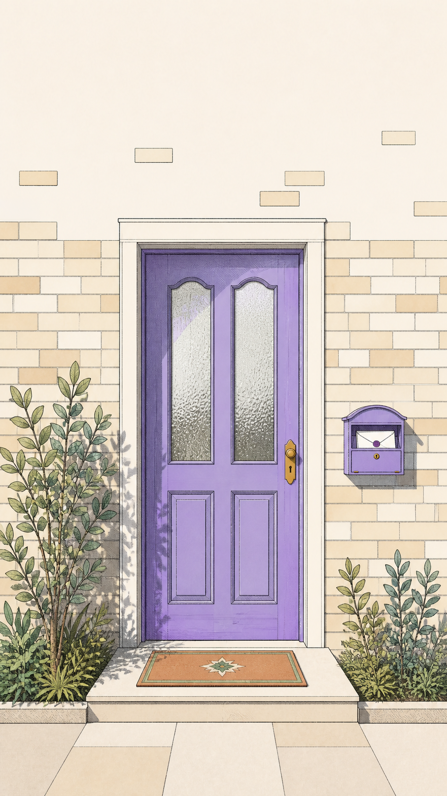

# 실행 화면 흐름 인벤토리

모든 경로는 로컬 개발 서버(`http://127.0.0.1:8443`)에서 확인할 수 있다. `:letterId`는 예시 편지 ID를 넣는 동적 경로이며, 로그인 보호 화면은 목업 로그인 상태에서 연다.

## 1. 첫 진입 · 가입

`/` 또는 `/intro` → `/onboarding` → `/login` → `/terms-consent` → `/nickname-entry` → `/onboarding-complete` → `/home`

- 보조 상태: `/dormant-account`
- 호환 리디렉션: `/onboarding-new` → `/onboarding`

## 2. 홈 · 마음 선택

`/home` → 편지 쓰기(`/write-letter`) 또는 편지 읽기(`/listen-entry-a`)

- 홈 시안: `/home-cards`, `/home-scene`, `/home-ruled`
- 방향 시안: `/direction-b`, `/direction-c`
- 이전 시안 리디렉션: `/direction-a` → `/home`

## 3. 편지 작성 · 발송

`/write-letter` → `/letter-preview` → `/letter-safety-review` → `/letter-sent?id=:letterId` → `/mailbox/my/:letterId`

- 작성 중 안전/중단: `/urgent-support`, `/return-letter/:letterId`, `/letter-withdrawn/:letterId`
- 감정 마무리: `/gratitude/:letterId`
- 비교 시안: `/write-letter-a`, `/write-letter-b`, `/write-letter-c`

## 4. 편지 읽기 · 답장 작성

`/listen-entry-a` → `/waiting-letters` → `/assign-letter/:letterId` → `/assigned-letter/:letterId` → `/read-letter/:letterId` → `/write-reply/:letterId` → `/reply-review/:letterId` → `/reply-sending/:letterId` → `/reply-sent/:letterId`

- 읽기 전 약속: `/reader-promise?id=:letterId`
- 답장 도착/여정: `/reply-arrived/:letterId`, `/letter-journey/:letterId`
- 읽기 상태/시안: `/read-letter`, `/read-letter-a`, `/read-letter-b`, `/read-letter-c`
- 답장 시안: `/write-reply`, `/write-reply-a`, `/write-reply-b`, `/write-reply-c`, `/reply-preview`
- 듣기 진입 시안: `/listen-entry-b`, `/listen-entry-c`, `/listen-entry-empty`

## 5. 편지함 · 기록

`/mailbox` → `/mailbox/my/:letterId` 또는 `/mailbox/replied/:letterId`

- 편지함 상태: `/mailbox-empty`, `/mailbox-reply-arrived-demo`, `/mailbox-my-replied-demo`
- 상태/아이콘 실험: `/mailbox-demo`, `/mailbox-demo-inline-directional-status`, `/mailbox-demo-directional-status`, `/mailbox-demo-status-icons`, `/mailbox-demo-upload-icons`, `/mailbox-demo-icons`
- 편지함 시안: `/mailbox-concept-a`, `/mailbox-concept-b`, `/mailbox-concept-c`, `/mailbox-concept-d`

## 6. 나의 공간 · 알림 · 설정

`/my-space` → `/saved-excerpts` · `/received-replies` · `/anonymous-name-settings` · `/account-settings` · `/notifications`

- 계정: `/login-information`, `/data-and-privacy`, `/account-withdrawal`, `/withdrawal-complete`, `/account-restricted`
- 안내 문서: `/service-guide`, `/safety-guide`, `/privacy-policy`, `/terms-of-service`, `/app-info`
- 알림: `/notifications`, `/notification-settings`

## 7. 신고 · 안전 흐름

- 편지 신고: `/report-letter/:letterId`, `/report-letter-figma/:letterId`, `/report-letter-legacy/:letterId`, `/report-letter-demo`, `/report-letter-complete-demo`
- 답장 신고: `/report-reply/:letterId`, `/report-reply/:letterId/complete`
- 안전 조치: `/reply-safety-review/:letterId`, `/return-letter/:letterId`, `/safety-management`, `/urgent-support`

## 8. 내부 검토 · 프로토타입

- `/prototype/mind-content-board`
- `/prototype/letter-journey-lab`
- `/prototype/mailbox-list-lab`
- `/prototype/waiting-letters-list-lab`
- `/prototype/mailbox-mockup`, `/prototype/mailbox-mockup-2`, `/prototype/mailbox-mockup-3`, `/prototype/mailbox-mockup-4`, `/prototype/mailbox-mockup-5`
- `/prototype/anon-name-mockup`, `/prototype/anon-name-mockup-2`, `/prototype/anon-name-mockup-3`, `/prototype/anon-name-concepts`
- `/prototype/nav-icon-concepts`, `/prototype/terms-mockup`

## 9. 이전 감정 여정 경로

`/emotion-check-in`, `/writing-method`, `/guided-writing`, `/emotion-after`, `/emotion-summary`, `/guided-summary`은 데이터/소스 보존용이며 현재는 모두 `/home`으로 리디렉션한다.
